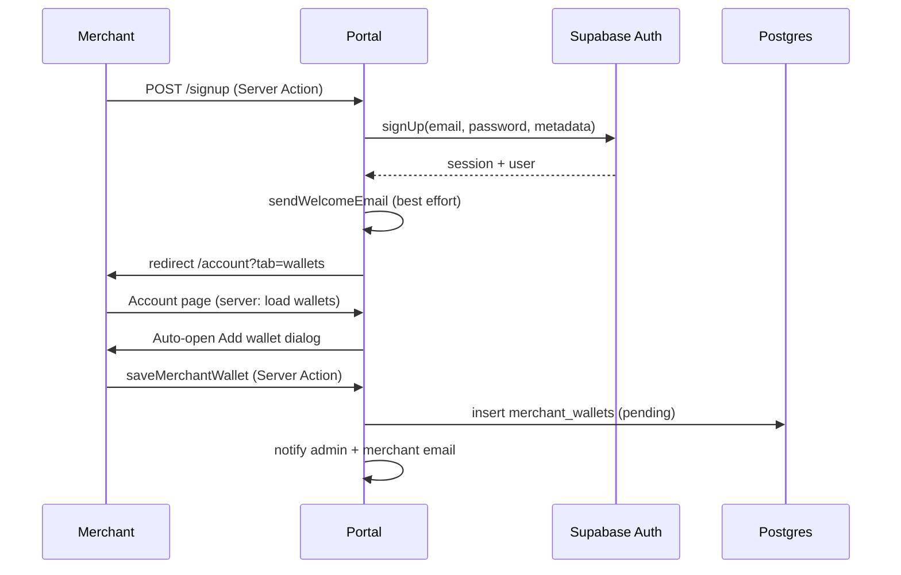
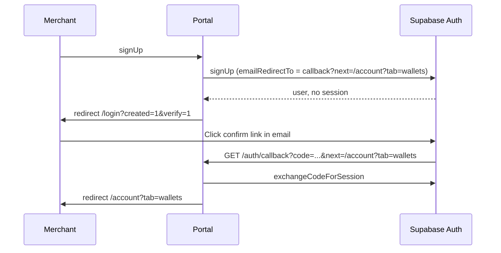

# Merchant account setup workflow

This document describes how a new merchant moves from signup to a wallet ready for admin verification. It reflects the portal implementation as of the wallet-onboarding refactor (`/account?tab=wallets`).

It also defines **who “a user” is**, whether they can have **multiple payout wallets**, and **how often emails fire** — plus a recommended policy aligned with common SaaS / payment-platform practice.

## Users, login accounts, and payout wallets

Use these terms consistently in support and product copy:

| Term | Meaning in Crypto Pay today |
|------|-----------------------------|
| **Login account** | One [Supabase Auth](https://supabase.com/docs/guides/auth) user per email address. Sign up again with the same email → “already registered.” |
| **Merchant profile** | The same login account; metadata (`first_name`, `full_name`, `phone`) lives on `auth.users` / `user_profiles`. |
| **Payout wallet** | A named row in `merchant_wallets` (network + public address + label). **Many per login account.** |
| **Primary wallet** | At most one wallet per user with `is_primary = true`; synced to legacy `user_wallet_profiles` for older code paths. |
| **Tenant / membership** | Optional `memberships` row for **staff** roles (`admin`, `staff`, etc.). Staff may use `/admin`; that is separate from merchant wallet onboarding. |

**Can one person have many login accounts?**  
No — one email → one auth user. They can sign in with password or OAuth, but not duplicate the same email.

**Can one merchant add many payout wallets?**  
**Yes.** The schema allows multiple `merchant_wallets` per `user_id`, with a **unique label per user** (e.g. “Main BTC”, “USDC Treasury”). Each wallet goes through its own `pending` → `verified` / `rejected` cycle. Only one should be marked primary for default payout semantics.

**Can one login belong to multiple businesses (tenants)?**  
The data model supports `memberships` across tenants for **internal/staff** use. The self-serve **merchant dashboard** (`/account`) is centered on the authenticated user and their wallets, not a multi-store picker. Multi-tenant merchant switching is not part of this onboarding flow today.

**Runner API:** The settlement Runner app registers wallets with `source: runner_api` (pending until admin verifies). See **[RUNNER_INTEGRATION.md](./RUNNER_INTEGRATION.md)** for HMAC API, `external_id` linking, and outbound webhooks when status changes.

## Overview

Account setup is **not** a separate app section anymore. Onboarding lives on the **account dashboard**:

| Step | User action | System behavior |
|------|-------------|-----------------|
| 1 | Create account | Supabase Auth user + profile metadata |
| 2 | (If required) Verify email | Magic link → `/auth/callback` → wallet tab |
| 3 | Add payout wallet | Row in `merchant_wallets` (`status: pending`) |
| 4 | Wait for admin review | Email to ops; merchant sees pending in UI |
| 5 | Accept payments | **Coming soon** — checklist step 3 |

The in-app checklist is `AccountSetupChecklist` on the dashboard **Overview** tab. Wallet CRUD is on the **Wallets** tab.

## Canonical URLs

Defined in `apps/portal/lib/account/paths.ts`:

| Constant / path | Purpose |
|-----------------|--------|
| `/account?tab=wallets` | **Primary onboarding destination** after signup / sign-in with no wallets |
| `/account?tab=overview` | Default tab; shows setup checklist |
| `/account/setup` | **Legacy** — redirects to wallet tab (old email links) |
| `/account/get-started` | **Legacy** — redirects to wallet tab |

Email confirmation callback (encoded `next`):

```
{APP_URL}/auth/callback?next=%2Faccount%3Ftab%3Dwallets
```

Built by `accountWalletSetupCallbackUrl(appUrl)`.

## End-to-end flows

### A. Sign up (email + password, session returned)

Supabase is configured to return a session immediately (no email confirm), or confirm is disabled for the project.



**Code:** `apps/portal/app/[locale]/(login)/actions.ts` → `signUp()`

### B. Sign up (email confirmation required)

No session until the user clicks the link in email.



**Code:** `apps/portal/app/auth/callback/route.ts`

### C. Sign in (existing merchant)

```mermaid
flowchart TD
  A[signInWithPassword] --> B{Explicit redirect param?}
  B -->|yes, starts with /| C[Use that path]
  B -->|no| D{Staff / admin membership?}
  D -->|yes| E[/admin/dashboard]
  D -->|no| F{Any merchant_wallets?}
  F -->|no| G[/account?tab=wallets]
  F -->|yes| H[/account]
```

**Code:** `apps/portal/app/[locale]/(login)/actions.ts` → `signIn()`

### D. OAuth (Google, etc.)

Same callback route as email confirmation.

| Condition | Redirect |
|-----------|----------|
| Staff / admin membership or admin email | `next` or `/admin/dashboard` |
| `mode=signup` and no `next` | `/account?tab=wallets` |
| Sign-in, no wallets, no `next` | `/account?tab=wallets` |
| Otherwise | `next` or `/account` |

**Code:** `apps/portal/app/auth/callback/route.ts`

### E. Protected routes (middleware)

`apps/portal/proxy.ts` (Next.js proxy / middleware):

- `/account/*` requires `supabase.auth.getUser()` (verified user, not cookie-only `getSession()`).
- Logged-in users hitting `/login` or `/signup` are sent to `/account` or `/admin/dashboard` (locale-aware).
- `/auth/callback` is excluded from locale/auth redirects so PKCE exchange can complete.

**Layout:** `apps/portal/app/[locale]/account/layout.tsx` also calls `getUser()` and redirects to `/login` if missing.

## Dashboard structure

```
/account
├── ?tab=overview   → stats + AccountSetupChecklist
├── ?tab=wallets    → wallet table + add/edit dialog
└── ?tab=activity   → PaymentsComingSoon placeholder
```

**Server data:** `apps/portal/app/[locale]/account/page.tsx` loads user + wallets on the server.

**Client UI:** `apps/portal/components/account/account-dashboard.tsx` + `merchant-wallet-dashboard.tsx`.

After wallet mutations, the client calls `router.refresh()` so the server page re-fetches wallets.

## Wallet submission (step 3 detail)

**Server Actions:** `apps/portal/app/[locale]/account/wallets/actions.ts`

| Action | Effect |
|--------|--------|
| `saveMerchantWallet` | Insert/update `merchant_wallets`, status `pending`, emails admin + merchant |
| `resendWalletVerification` | Re-notify admin for pending wallet |
| `deleteMerchantWallet` | Delete only if `status === 'pending'` |

**Legacy sync:** Updates `user_wallet_profiles` when primary wallet changes (migration compatibility).

**Validation:** `apps/portal/lib/wallets/validation.ts` (network, address format, label).

## Setup checklist (product steps)

Copy keys: `Account.setup` in `apps/portal/messages/en.json`.

1. **Add a payout wallet** — user adds public address (no private keys).
2. **Admin verification** — ops reviews; merchant can **Resend** from Wallets tab while pending.
3. **Accept payments** — not live; links to `/developers`.

## Marketing vs authenticated paths

| Path | Audience | Behavior |
|------|----------|----------|
| `/get-started` | Public | Marketing checklist → links to `/signup` |
| `/account` | Authenticated | Real merchant dashboard |
| `/account?tab=wallets` | Authenticated | Onboarding / wallet management |

Do not confuse marketing `/get-started` with account setup.

## Email communications

### What the product sends today (transactional)

All current onboarding-related sends are **transactional** (user-initiated or required for the action they started). There is **no** automated marketing drip in this flow.

| # | Trigger | Recipient | Channel | Typical count per event |
|---|---------|-----------|---------|-------------------------|
| 1 | Signup + email confirm enabled | Merchant | Supabase Auth | **1** confirm email (not Resend) |
| 2 | Signup success (`signUp` action) | Merchant | Resend `welcome` | **1** per signup (best effort; failure does not block signup) |
| 3 | Wallet saved or updated (`saveMerchantWallet`) | Merchant | `wallet_submitted_merchant` | **1** per save |
| 4 | Same | Admin (`ADMIN_REVIEW_EMAIL`) | `wallet_pending_admin` | **1** per save |
| 5 | Merchant clicks **Resend** on pending wallet | Admin only | `wallet_pending_admin` (`kind: resend`) | **1** per click — **no cooldown in code** |
| 6 | Admin approves or rejects wallet | Merchant | `wallet_status_merchant` | **1** per pending review cycle (deduped in DB + Resend) |

**Not emailed today:** “still pending” reminders to merchants, nudges to add a first wallet, or digest summaries. Status is shown **in-app** (dashboard checklist + Wallets tab).

### Example volume (honest scenarios)

| Scenario | Approx. emails to merchant | Approx. emails to admin |
|----------|----------------------------|-------------------------|
| Signup, confirm email, add **one** wallet | 2 (confirm + welcome) + 1 (submitted) = **3** | **1** |
| Signup, no confirm, add **one** wallet | 1 (welcome) + 1 (submitted) = **2** | **1** |
| Add **three** wallets in one session | 3 × submitted = **3** | **3** |
| Merchant hits Resend **five** times | **0** | **5** reminders |

Supabase Auth rate limits may cap confirm/welcome-style volume separately (surfaced in signup UI).

### Recommended policy (industry practice)

Research on SaaS and payment onboarding consistently favors **event-driven, low-volume transactional mail** over time-based drips ([MailerToGo — transactional vs marketing](https://resources.mailertogo.com/guide/welcome-email-sequences-saas-onboarding-api-implementation), [Martechs — behavior-triggered onboarding](https://blog.martechs.io/2025/03/29/the-ultimate-guide-to-automate-onboarding-emails-2025/), [React Emails Pro — cadence](https://reactemailspro.com/blog/saas-onboarding-email-sequence)):

| Principle | Recommendation for Crypto Pay |
|-----------|-------------------------------|
| **Activation metric** | First **verified** payout wallet (not merely signup). |
| **Cadence** | During onboarding, aim for **≤ 1 merchant-facing email per day** except the signup day, when **confirm + welcome** is acceptable. |
| **Behavior over calendar** | Send when state changes (submitted, verified, rejected), not “day 3 tips” until product marketing is intentional. |
| **Suppress noise** | If the user already has a verified wallet, skip “add your first wallet” mail; use in-app checklist only. |
| **Resend guardrails** | Rate-limit admin resend (e.g. **1 / wallet / 24h**) to prevent support spam. |
| **Split streams** | Keep wallet/security on **transactional**; any newsletter needs `List-Unsubscribe` and opt-in (`user_settings` has marketing flags for future use). |
| **Fintech alignment** | Per-wallet verification matches tiered KYC patterns (light onboarding first, deeper review as risk grows) — see [Payoro — tiered KYC](https://payoro.com/kyc-aml-compliance-payouts-platforms/). |

**Current gaps vs recommendation (for engineering backlog):**

- No resend cooldown or deduplication on `saveMerchantWallet` if address unchanged.
- Welcome email always fires on signup even when Supabase also sends confirm (possible duplicate on signup day).
- No “merchant still pending after N days” reminder (optional; only if in-app + email together).

### Email reference (implementation)

| Trigger | Function / template | CTA URL |
|---------|---------------------|---------|
| Signup welcome | `sendWelcomeEmail` → `welcome` | `{APP_URL}/account?tab=wallets` |
| Wallet submitted (merchant) | `notifyMerchantWalletSubmitted` | — |
| Wallet pending (admin) | `notifyAdminWalletReview` | Admin wallets UI |
| Wallet verified / rejected | `notifyMerchantWalletStatus` | `/account` or `/account?tab=wallets` |

Requires `NEXT_PUBLIC_APP_URL`, `RESEND_API_KEY`, `ADMIN_REVIEW_EMAIL` (default `photospheremedia00@gmail.com`), and `EMAIL_REPLY_TO` (merchant replies — default same as `ADMIN_REVIEW_EMAIL`). See [LOCAL_DEV.md](./LOCAL_DEV.md).

**Routing**

| Audience | To | Reply-To | Primary CTA |
|----------|-----|----------|-------------|
| Merchant | User email | `EMAIL_REPLY_TO` | `{APP_URL}/account?tab=wallets` |
| Internal ops | `ADMIN_REVIEW_EMAIL` | Merchant email | `{APP_URL}/admin/wallets?status=pending` |

URLs are built in `apps/portal/lib/email/routing.ts` (`appAbsoluteUrl`, `EMAIL_ROUTES`).

**Code triggers (do not call `sendEmail` directly from pages)**

| Event | Trigger location | Workflow helper |
|-------|------------------|-----------------|
| Email/password signup + session | `app/[locale]/(login)/actions.ts` → `scheduleEmailWork` | `runWelcomeEmailWorkflow` |
| OAuth signup (`mode=signup`) | `app/auth/callback/route.ts` → `scheduleEmailWork` | `runWelcomeEmailWorkflow` |
| Wallet create / material update | `app/[locale]/account/wallets/actions.ts` | `runWalletPendingAdminNotifyWorkflow` (awaited → `ADMIN_REVIEW_EMAIL` + `ADMIN_ALLOWED_EMAILS`) |
| Merchant resend reminder | `resendWalletVerification` action | `notifyAdminWalletReview` (`kind: resend`) |
| Admin verify/reject | `app/[locale]/admin/wallets` → `PATCH /api/admin/wallets` | `runWalletStatusEmailWorkflow` (awaited; merchant notified) |
| Runner API wallet upsert | `supabase/functions/runner-api` | Resend + idempotency header |

Guards: merchant status email only when `pending → verified|rejected`; **at most one** status email per `verification_requested_at` (`merchant_status_emailed_for_request`); admin PATCH uses `status = pending` conditional update; merchant **label-only** edits do not re-open verification; address/network change starts a new cycle; Resend idempotency keys include wallet + request timestamp. Side effects use Next.js [`after()`](https://nextjs.org/docs/app/api-reference/functions/after) via `lib/email/schedule.ts` so forms and redirects are not blocked.

### Resend dashboard — what to use (Crypto Pay)

Per [Resend: transactional vs marketing](https://resend.com/docs/knowledge-base/what-sending-feature-to-use), wallet/onboarding mail is **transactional** (Send Email API from code), not Broadcasts.

| Resend area | Use for Crypto Pay? | Notes |
|-------------|---------------------|--------|
| **Domains** | **Yes — required** | `cryptopay.sale` verified (SPF/DKIM/DMARC). `EMAIL_FROM` must use this domain. |
| **API keys** | **Yes — required** | `RESEND_API_KEY` in Netlify + Supabase (`pnpm resend:sync`). Never commit keys. |
| **Logs** | **Yes — ops** | Find wallet/admin sends; filter by subject `[Crypto Pay]` or recipient. |
| **Metrics** | **Yes — monitoring** | Bounce/complaint trends; investigate if wallet mail stops arriving. |
| **Settings** | **Yes** | Default sending domain; enable **Receiving** only if you want `support@cryptopay.sale` inbound in Resend (optional; Reply-To is already Gmail). |
| **Webhooks** | **Recommended later** | Subscribe to `email.sent`, `email.delivered`, `email.bounced`, `email.complained` for alerting or audit storage — not required for sends to work. |
| **Templates** (dashboard) | **No (for now)** | HTML lives in repo: `lib/email/templates.ts`, `lib/email/templates/wallet.ts`. Preview: `pnpm email:preview`. Optional future: publish Resend templates and pass `template_id` from API. |
| **Broadcasts** | **No (onboarding)** | Marketing blasts / newsletters. Use only with explicit opt-in (`user_settings` marketing flags). Not for wallet verify or welcome. |
| **Automations** | **No (onboarding)** | Resend no-code drips. We trigger from app code (`workflows.ts`, idempotency keys) on DB events — keep logic in git. |
| **Audience** | **Later (marketing)** | Contact lists for Broadcasts. Pair with newsletter signup + unsubscribe before use. |

**Auth email:** Signup confirm/reset HTML is generated locally (`pnpm email:sync-auth`) and applied in **Supabase Auth → SMTP** (Resend SMTP), not via Resend Templates UI.

**Quick checks**

1. **Domains** → `cryptopay.sale` = Verified  
2. **Logs** → send test: `cd apps/portal && pnpm email:verify --send-test you@example.com`  
3. **API keys** → same key as production `RESEND_API_KEY`  

**Template tooling**

```bash
cd apps/portal
pnpm email:preview              # HTML files in .email-previews/
pnpm email:sync-auth              # writes supabase/templates/*.html
pnpm email:sync-auth:push         # + remote (needs SUPABASE_ACCESS_TOKEN)
pnpm email:test-suite you@example.com   # send all onboarding templates
```

## Supabase configuration

**Authentication → URL configuration**

- **Redirect URLs:** must include `{APP_URL}/auth/callback`
- **Site URL:** production or `http://localhost:3001` for local dev

**Email confirm:** If enabled, flow B applies; ensure redirect allowlist includes your app origin.

**Rate limits:** Signup may hit auth email rate limits; surfaced in UI with a clear message.

## Local development

```bash
pnpm dev:setup      # creates dev user
pnpm dev:portal     # http://localhost:3001
```

Use `apps/portal/.env.development.local` so `NEXT_PUBLIC_APP_URL=http://localhost:3001` — otherwise confirm links point at production.

Walk through signup → wallet tab → add wallet. See [LOCAL_DEV.md](./LOCAL_DEV.md).

## Tests

Playwright: `apps/portal/tests/auth.spec.ts` — signup expects wallet onboarding URL or verify-email login.

## Key files (reference)

| Area | File |
|------|------|
| Path constants | `apps/portal/lib/account/paths.ts` |
| Sign up / in | `apps/portal/app/[locale]/(login)/actions.ts` |
| OAuth / email callback | `apps/portal/app/auth/callback/route.ts` |
| Route protection | `apps/portal/proxy.ts` |
| Account page | `apps/portal/app/[locale]/account/page.tsx` |
| Wallet actions | `apps/portal/app/[locale]/account/wallets/actions.ts` |
| Legacy redirects | `account/setup/page.tsx`, `account/get-started/page.tsx` |
| DB migration | `supabase/migrations/20260525140000_merchant_wallets.sql` |

## Extending the workflow

When payment acceptance ships:

1. Update checklist step 3 (`Account.setup` i18n).
2. Replace `PaymentsComingSoon` on Activity tab.
3. Optionally gate “go live” on `merchant_wallets.status = 'verified'`.
4. Add middleware or server check before API key / charge creation.

Keep `ACCOUNT_WALLET_SETUP_PATH` as the post-auth destination until a later onboarding step exists; then add a new constant and redirect matrix in `paths.ts` + auth actions + callback.
