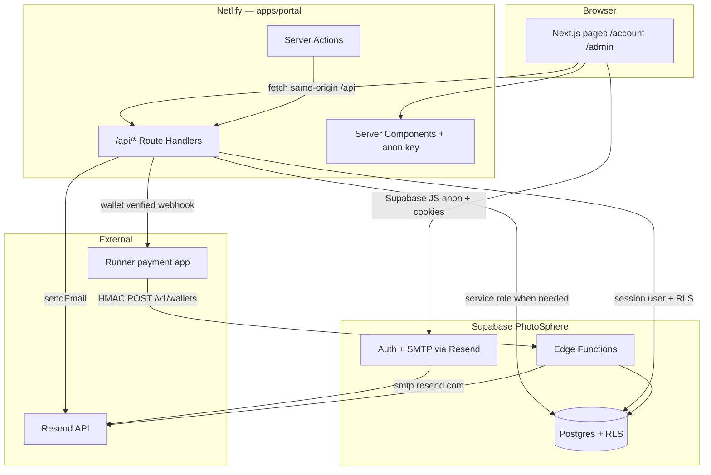
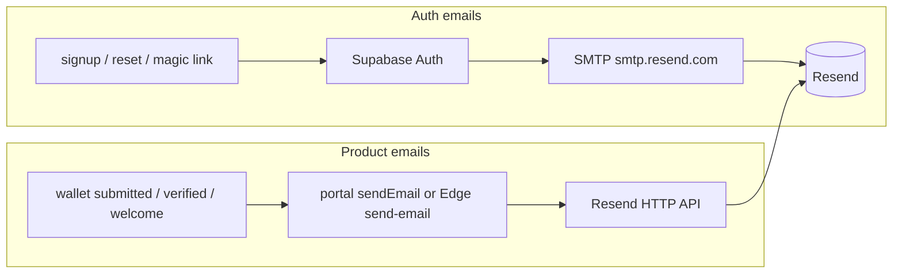

# Environment variables & APIs — end-to-end guide

Single reference for **how configuration flows** through Crypto Pay and **how HTTP APIs are called** (portal, Supabase Edge, Runner). Use this before adding routes, env vars, or integrations.

**Related (detail):** [PLATFORM_CONFIGURATION.md](./PLATFORM_CONFIGURATION.md) · [API_STYLE_GUIDE.md](./API_STYLE_GUIDE.md) · [ADMIN_AND_USER_API_REFERENCE.md](./ADMIN_AND_USER_API_REFERENCE.md) · [RUNNER_INTEGRATION.md](./RUNNER_INTEGRATION.md) · [EMAIL_SETUP_CRYPTO_PAY.md](./EMAIL_SETUP_CRYPTO_PAY.md)

**Production Supabase project:** PhotoSphere `usbxwewohpsbjwiuazpf` — do not point local env at another ref without explicit approval.

---

## 1. System map



| Layer | Host | Who calls it |
|-------|------|----------------|
| **Portal UI** | `cryptopay.sale` (Netlify) | Merchants, staff |
| **Portal `/api/*`** | Same origin as UI | Browser `fetch`, Server Actions |
| **Supabase Auth** | `*.supabase.co` | Browser (`@supabase/ssr`), email links |
| **Supabase DB** | Postgres behind Supabase | Portal (anon + RLS or service role), Edge |
| **Edge Functions** | `…/functions/v1/*` | Runner (HMAC), portal fallback for email |
| **Resend** | `api.resend.com` | Portal server, Auth SMTP, Edge |

**Boundary:** Crypto Pay owns accounts, wallets, admin verification, and email. Runner owns checkout/settlement; it only **registers** payout addresses via the Runner API until admin sets `verified`.

---

## 2. Environment variables

### 2.1 Naming rules

| Prefix | Visible in browser? | Use for |
|--------|---------------------|---------|
| `NEXT_PUBLIC_*` | **Yes** (bundled into client JS) | Supabase URL/anon key, app URL, Turnstile site key, public social URLs |
| No prefix | **No** (server-only on Netlify) | Service role, Resend, AI keys, internal keys, Skrill |
| `env(...)` in `supabase/config.toml` | Local Supabase CLI only | Local Auth SMTP placeholder |

**Never** put `SUPABASE_SERVICE_ROLE_KEY`, `RESEND_API_KEY`, `RUNNER_API_SECRET`, or `INTERNAL_API_KEY` in `NEXT_PUBLIC_*`.

### 2.2 Source of truth

| File | Git | Purpose |
|------|-----|---------|
| `apps/portal/.env.local` | Ignored | **Developer source of truth** for app + sync scripts |
| `apps/portal/.env.example` | Committed | Template — paste placeholders only |
| `apps/portal/.env.development.local` | Ignored | Overrides `NEXT_PUBLIC_APP_URL` → `http://localhost:3001` in dev |
| `.env.supabase` | Ignored | `SUPABASE_ACCESS_TOKEN`, `SUPABASE_PROJECT_REF` for CLI/MCP |
| `.env.netlify` | Ignored | `NETLIFY_AUTH_TOKEN` for CLI |
| Netlify site env | Dashboard / `pnpm netlify:env-sync` | **Production runtime** for Next.js |
| Supabase Edge secrets | Dashboard / `pnpm resend:sync` | Edge functions (`runner-api`, `send-email`, …) |
| GitHub Actions secrets | GitHub UI | CI only — not Netlify runtime |

`git push` updates code only. **Env and Supabase data** change via sync scripts, dashboard, or migrations.

### 2.3 Where each variable lives

| Variable | Portal local | Netlify | Supabase Edge | Supabase Auth SMTP | Browser |
|----------|:------------:|:-------:|:-------------:|:------------------:|:-------:|
| `NEXT_PUBLIC_SUPABASE_URL` | ✓ | ✓ | auto | — | ✓ |
| `NEXT_PUBLIC_SUPABASE_ANON_KEY` | ✓ | ✓ | auto | — | ✓ |
| `SUPABASE_SERVICE_ROLE_KEY` | ✓ | ✓ | auto | — | ✗ |
| `NEXT_PUBLIC_SUPABASE_FUNCTIONS_URL` | ✓ | ✓ | — | — | ✓ |
| `NEXT_PUBLIC_APP_URL` | ✓ | ✓ | — | site_url (via sync) | ✓ |
| `RESEND_API_KEY` | ✓ | ✓ | ✓ | smtp password (via sync) | ✗ |
| `EMAIL_FROM` / `EMAIL_REPLY_TO` | ✓ | ✓ | ✓ | admin/from (partial) | ✗ |
| `ADMIN_REVIEW_EMAIL` | ✓ | ✓ | — | — | ✗ |
| `ADMIN_ALLOWED_EMAILS` | ✓ | ✓* | — | — | ✗ |
| `GROQ_API_KEY` / `OPENAI_API_KEY` | ✓ | ✓ | — | — | ✗ |
| `RUNNER_API_KEY` / `RUNNER_API_SECRET` | ✓ | — | DB `runner_api_clients` | — | ✗ |
| `INTERNAL_API_KEY` | ✓ | ✓ | — | — | ✗ |
| `BTC_PROVIDER_*` | ✓ | ✓ | — | — | ✗ |
| `SUPABASE_ACCESS_TOKEN` | `.env.supabase` | — | — | — | ✗ |

\* `netlify:env-sync` imports allowlisted keys from `.env.local` only when set and not `__PASTE*`.

### 2.4 Variable reference (by concern)

#### Supabase (database + session)

| Variable | Role |
|----------|------|
| `NEXT_PUBLIC_SUPABASE_URL` | Project API base |
| `NEXT_PUBLIC_SUPABASE_ANON_KEY` | Client + server user-scoped queries; **RLS applies** |
| `SUPABASE_SERVICE_ROLE_KEY` | Bypass RLS — admin APIs, scripts, some server paths only |
| `NEXT_PUBLIC_SUPABASE_FUNCTIONS_URL` | Base for Edge calls from browser/server |
| `SUPABASE_PROJECT_REF` | `usbxwewohpsbjwiuazpf` — scripts and CI |

#### App URLs & branding

| Variable | Role |
|----------|------|
| `NEXT_PUBLIC_APP_URL` | Auth redirects, email links, canonical origin (`https://cryptopay.sale` prod) |
| `EMAIL_ASSET_ORIGIN` / `EMAIL_LOGO_URL` | Override logo URL in HTML mail (avoid `localhost` in real sends) |
| `NEXT_PUBLIC_SOCIAL_*` | Optional footer links |

#### Email (Resend)

| Variable | Role |
|----------|------|
| `RESEND_API_KEY` | Product email (`lib/email/sender.ts`) + Auth SMTP password after `resend:sync` |
| `EMAIL_FROM` | From header — must use verified domain (`@cryptopay.sale`) |
| `EMAIL_REPLY_TO` | Reply-To for merchant replies (monitored inbox) |
| `ADMIN_REVIEW_EMAIL` | To: address for new wallet review notifications |

Auth mail (confirm signup, reset password) uses **Supabase Auth → Resend SMTP**, not the portal `sendEmail` path. Both need the same Resend key after sync.

#### Admin access

| Variable | Role |
|----------|------|
| `ADMIN_ALLOWED_EMAILS` | Comma-separated emails allowed into `/admin` (with session) |
| Memberships in DB | Staff roles on `crypto-pay-admin` tenant — see `lib/admin-auth.ts` |

#### Runner integration

| Variable | Role |
|----------|------|
| `RUNNER_API_KEY` | `cpk_…` — `X-CryptoPay-Key` header |
| `RUNNER_API_SECRET` | `cps_…` — HMAC only on Runner server |
| `RUNNER_API_BASE_URL` | Usually `…/functions/v1/runner-api` |

Created with `pnpm --filter @crypto-pay/portal exec tsx scripts/create-runner-api-client.ts`. Secrets live in **Postgres**, not only env.

#### Internal automation

| Variable | Role |
|----------|------|
| `INTERNAL_API_KEY` | Header `x-internal-key` on `/api/internal/*` |
| `BTC_PROVIDER_API_KEY` / `BTC_PROVIDER_BASE_URL` | Chain watcher proxy |

#### Payments (Skrill) & AI

| Variable | Role |
|----------|------|
| `SKRILL_*` | Legacy/card checkout routes under `/api/payments/` |
| `GROQ_API_KEY` / `OPENAI_API_KEY` | `/api/chat` (optional; rule-based fallback if empty) |

### 2.5 Sync playbook (run in this order for new env)

```bash
# 1. Fill apps/portal/.env.local from .env.example (dashboard keys)
# 2. CLI link + token
pnpm supabase:connect          # writes .env.supabase

# 3. Email → Supabase Auth SMTP + edge secrets
pnpm resend:sync
pnpm resend:verify             # Supabase SMTP + portal domain

# 4. Production Netlify runtime
pnpm netlify:connect
pnpm netlify:env-sync          # allowlisted vars → site env
# 5. Redeploy Netlify for env changes to apply

# 6. Schema (when migrations change)
pnpm db:push
pnpm db:types
```

| Command | Updates |
|---------|---------|
| `pnpm resend:sync` | Edge: `RESEND_API_KEY`, `EMAIL_FROM`, `EMAIL_REPLY_TO`; Auth SMTP via Management API |
| `pnpm netlify:env-sync` | Netlify site env from `.env.local` (see `scripts/sync-netlify-env.sh` allowlist) |
| `pnpm supabase:secrets` | GitHub Actions secrets (CI admin) |
| `pnpm email:sync-auth:push` | Branded Auth email HTML on Supabase project |

---

## 3. Authentication (how sessions reach APIs)

### 3.1 Merchant / staff browser session

1. User signs in via Supabase Auth (password, OAuth, or magic link).
2. `@supabase/ssr` stores session in **HTTP-only cookies**.
3. Route handlers call `createClient()` from `lib/supabase/server.ts` → `auth.getUser()`.
4. Database queries use the **anon key + user JWT** so **RLS** enforces `auth.uid()`.

**401** = no session. **403** = session but missing permission (admin routes).

### 3.2 Admin APIs

`/api/admin/*` calls `checkAdminAccess()` (`lib/admin-auth.ts`):

- Requires signed-in user.
- Grants access via `ADMIN_ALLOWED_EMAILS` and/or `memberships` on admin tenant with role permissions.
- Individual routes check `permissions` (e.g. `canViewMerchants`, `canManageStaff`).

### 3.3 Internal APIs

`/api/internal/*` requires:

```http
x-internal-key: <INTERNAL_API_KEY>
```

No cookie session. Used for automation (e.g. BTC watcher), not browsers.

### 3.4 Runner API (Edge)

`POST https://<ref>.supabase.co/functions/v1/runner-api/v1/wallets`

- Headers: `X-CryptoPay-Key`, `X-CryptoPay-Timestamp`, `X-CryptoPay-Signature`
- HMAC over method + path + body — see [RUNNER_INTEGRATION.md](./RUNNER_INTEGRATION.md)
- Credentials from `runner_api_clients` table, not merchant cookies

### 3.5 Public / low-auth routes

| Route | Auth |
|-------|------|
| `GET /api/health` | None |
| `GET /api/crypto-rates` | None |
| `GET /api/user` | Optional — returns `null` if logged out |
| `POST /api/chat` | Optional guest; rate-limited |
| `POST /api/analytics/track` | Public beacon |

---

## 4. Portal APIs (`/api/*`)

All handlers live under `apps/portal/app/api/**/route.ts`. Follow [API_STYLE_GUIDE.md](./API_STYLE_GUIDE.md).

### 4.1 Route families

| Prefix | Caller | Auth |
|--------|--------|------|
| `/api/account/*` | Merchant UI | Session + RLS / user-scoped service |
| `/api/admin/*` | Admin UI | `checkAdminAccess()` + permissions |
| `/api/internal/*` | Cron, scripts, ops | `INTERNAL_API_KEY` |
| `/api/chat`, `/api/chat/*` | Widget | Optional session + rate limit |
| `/api/user` | Layout / hooks | Session optional |

**Living index:** [ADMIN_AND_USER_API_REFERENCE.md](./ADMIN_AND_USER_API_REFERENCE.md) — extend when adding routes.

### 4.2 Merchant wallet API (core product)

| Method | Path | Purpose |
|--------|------|---------|
| `GET` | `/api/account/wallets` | List current user’s wallets |
| `POST` | `/api/account/wallets` | Create wallet (`pending`) → admin email |
| `PATCH` | `/api/account/wallets/[id]` | Update label/address (guards apply) |
| `DELETE` | `/api/account/wallets/[id]/delete` | Remove wallet |
| `POST` | `/api/account/wallets/[id]/resend` | Resend admin review email (cooldown) |

Server logic: `lib/wallets/merchant-wallet-service.ts`. Emails: `lib/email/sender.ts` + `notify-admin.ts`.

### 4.3 Admin wallet API

| Method | Path | Purpose |
|--------|------|---------|
| `GET` | `/api/admin/wallets` | List/filter wallets |
| `PATCH` | `/api/admin/wallets` | Verify / reject → merchant email + Runner webhook |

### 4.4 Standard JSON errors

Use `apps/portal/lib/api/route-error.ts`:

| Helper | Status | `code` |
|--------|--------|--------|
| `routeUnauthorized()` | 401 | `unauthorized` |
| `routeForbidden()` | 403 | `forbidden` |
| `routeBadRequest()` | 400 | `bad_request` |
| `routeError()` | 500 (default) | optional |

Parse bodies with `parseRequestJson()` — invalid JSON → **400**, not 500.

### 4.5 Multi-tenant safety

- **Never** accept `tenant_id` from the client on merchant routes.
- Resolve tenant from session + RLS, or `resolveTenantContext` for slug-based marketing/admin features.
- Admin cross-tenant access only with explicit permission (`canManageAllTenants`).

Details: [MULTITENANT_SECURITY_CHECKLIST.md](./MULTITENANT_SECURITY_CHECKLIST.md).

### 4.6 Calling APIs from the portal UI

Prefer small clients in `lib/api/*-client.ts`:

```typescript
// Browser: same-origin, cookies sent automatically
const res = await fetch("/api/account/wallets", { credentials: "include" });
```

Server Actions may call service modules directly instead of HTTP — same auth rules apply.

---

## 5. Supabase Edge Functions

Deployed to PhotoSphere; secrets via `supabase secrets set` / `pnpm resend:sync`.

| Function | JWT verify | Purpose |
|----------|------------|---------|
| `runner-api` | Off (HMAC instead) | Runner wallet CRUD, webhooks |
| `send-email` | On | Fallback Resend send from server |
| `verify-turnstile` | On | CAPTCHA verification |
| `rate-limit-check` | On | Upstash rate limits |
| `chat` | On | Legacy/alternate chat path |

Browser may call functions with **anon key + user JWT** when `verify_jwt` is true. Runner uses **HMAC** on `runner-api` only.

---

## 6. Email: two delivery paths



| Type | Configured by | Env |
|------|---------------|-----|
| Auth | `pnpm resend:sync` + optional `email:sync-auth:push` | `RESEND_API_KEY` as SMTP password |
| Product | Portal `RESEND_API_KEY` on Netlify | Same key; templates in `lib/email/` |

Verify both: `pnpm resend:verify`.

---

## 7. End-to-end journeys

### 7.1 New merchant signup → wallet pending

```text
1. POST signup (Server Action) → Supabase Auth signUp
2. Auth sends confirmation email (Resend SMTP) if confirmations enabled
3. User clicks link → /auth/callback?next=/account?tab=wallets
4. Merchant POST /api/account/wallets
5. Row in merchant_wallets (status=pending)
6. sendEmail → ADMIN_REVIEW_EMAIL + merchant confirmation
7. Admin sees wallet in /admin/wallets
```

Docs: [ACCOUNT_SETUP_WORKFLOW.md](./ACCOUNT_SETUP_WORKFLOW.md).

### 7.2 Admin verifies wallet

```text
1. Staff PATCH /api/admin/wallets { status: "verified" }
2. DB update + merchant status email
3. If source=runner_api → outbound webhook to Runner (wallet.status.updated)
4. Runner may poll GET /v1/wallets as backup
```

### 7.3 Runner attaches wallet (no portal UI)

```text
1. Runner POST …/runner-api/v1/wallets (HMAC)
2. Edge inserts merchant_wallets (pending, source=runner_api, external_id)
3. Admin review email (same as portal path)
4. After admin verify → webhook to Runner
```

### 7.4 Local development

```bash
cp apps/portal/.env.example apps/portal/.env.local
cp apps/portal/.env.development.local.example apps/portal/.env.development.local
pnpm dev:setup && pnpm dev:portal
```

- Portal: `http://localhost:3001`
- Supabase Auth redirect URLs must include `http://localhost:3001/auth/callback`
- Use `.env.development.local` so `NEXT_PUBLIC_APP_URL` is localhost

Details: [LOCAL_DEV.md](./LOCAL_DEV.md).

---

## 8. Guidelines for agents & developers

### Before adding an env var

- [ ] Add to `apps/portal/.env.example` with comment (no real secrets)
- [ ] If Netlify needs it: add to `scripts/sync-netlify-env.sh` `ALLOW` array
- [ ] If Edge needs it: document in this file + set via `supabase secrets set` or `resend:sync`
- [ ] Never use `NEXT_PUBLIC_` for secrets
- [ ] Update [PLATFORM_CONFIGURATION.md](./PLATFORM_CONFIGURATION.md) matrix if cross-cutting

### Before adding an API route

- [ ] Choose family: `account` | `admin` | `internal` | `payments` | public
- [ ] Enforce auth (session, `checkAdminAccess`, or `x-internal-key`)
- [ ] Use `route-error` helpers and `parseRequestJson`
- [ ] Document in [ADMIN_AND_USER_API_REFERENCE.md](./ADMIN_AND_USER_API_REFERENCE.md)
- [ ] RLS or explicit user filter — no client `tenant_id`
- [ ] `pnpm typecheck:portal` after changes

### Before production changes

- [ ] `pnpm resend:verify` and `pnpm supabase:status` (correct project ref)
- [ ] `pnpm netlify:env-sync` then **redeploy** Netlify
- [ ] Supabase Auth redirect URLs match `NEXT_PUBLIC_APP_URL`
- [ ] Do not `db reset` on PhotoSphere — see [SUPABASE_MAINTENANCE_AND_BACKUPS.md](./SUPABASE_MAINTENANCE_AND_BACKUPS.md)

### Troubleshooting quick reference

| Symptom | Check |
|---------|--------|
| 401 on `/api/account/*` | Session cookies; Supabase URL/anon key on Netlify |
| Admin 403 | `ADMIN_ALLOWED_EMAILS`; membership role |
| Auth email missing | `pnpm resend:verify`; Resend domain; Auth SMTP enabled |
| Product email missing | `RESEND_API_KEY` on Netlify; `ADMIN_REVIEW_EMAIL` |
| Runner 401 | Clock skew; HMAC path `/v1/wallets`; key/secret pair in DB |
| RLS violation | Query as user vs service role; policy in migration |
| Env change ignored on prod | Redeploy Netlify after `netlify:env-sync` |

---

## 9. Related commands

| Command | Purpose |
|---------|---------|
| `pnpm resend:verify` | Supabase SMTP + secrets + portal Resend domain |
| `pnpm resend:sync` | Push Resend config to Supabase |
| `pnpm netlify:env-sync` | Push `.env.local` → Netlify |
| `pnpm dev:setup` | Local dev user + admin membership |
| `pnpm db:push` | Apply migrations to linked project |
| `pnpm typecheck:portal` | Typecheck after API changes |

---

## 10. Further reading

| Topic | Document |
|-------|----------|
| Infra sync detail | [PLATFORM_CONFIGURATION.md](./PLATFORM_CONFIGURATION.md) |
| API conventions | [API_STYLE_GUIDE.md](./API_STYLE_GUIDE.md) |
| Route list | [ADMIN_AND_USER_API_REFERENCE.md](./ADMIN_AND_USER_API_REFERENCE.md) |
| Runner HMAC & webhooks | [RUNNER_INTEGRATION.md](./RUNNER_INTEGRATION.md) |
| Merchant vs admin UI | [MERCHANT_VS_ADMIN_UI.md](./MERCHANT_VS_ADMIN_UI.md) |
| Signup & wallet flow | [ACCOUNT_SETUP_WORKFLOW.md](./ACCOUNT_SETUP_WORKFLOW.md) |
| Production checklist | [PROD_READINESS.md](./PROD_READINESS.md) |
| GitHub vs Netlify secrets | [.github/secrets.env.example](../.github/secrets.env.example) |
