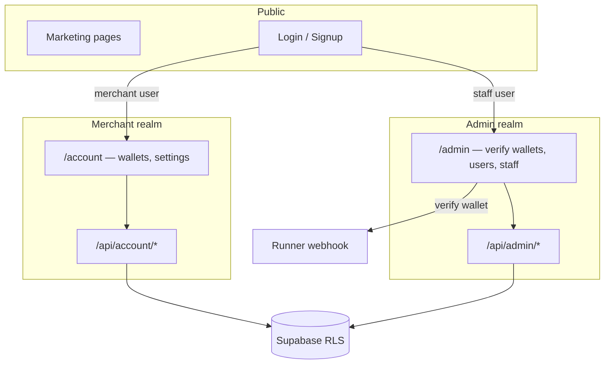

# Merchant UI vs Admin UI

Crypto Pay has **two authenticated surfaces** in the same Next.js app. They share Supabase Auth but differ by **realm** (`admin` vs `merchant`), routes, layouts, APIs, and permissions.

**Agents:** implement merchant features under `account/` + `/api/account/*`; staff features under `admin/` + `/api/admin/*`. Do not mix concerns in one page without explicit product approval.

**UI:** use [shadcn/ui](../.agents/skills/shadcn/SKILL.md) — components live in `apps/portal/components/ui/`; compose `Card`, `Dialog`, `Table`, etc. per the skill before writing custom markup.

**Configuration:** [PLATFORM_CONFIGURATION.md](./PLATFORM_CONFIGURATION.md)  
**Merchant onboarding:** [ACCOUNT_SETUP_WORKFLOW.md](./ACCOUNT_SETUP_WORKFLOW.md)

---

## At a glance

| | **Merchant (user) UI** | **Admin (staff) UI** |
|--|------------------------|----------------------|
| **Audience** | Businesses accepting crypto | Crypto Pay internal operators |
| **Home** | `/account` | `/admin/dashboard` |
| **Layout** | `app/[locale]/account/layout.tsx` | `app/[locale]/admin/layout.tsx` |
| **Auth guard** | `requireMerchantSession()` / protected `/account` | `requireAdminSession()` / `checkAdminAccess()` |
| **Data access** | RLS as owning `user_id` | Staff roles + `is_cp_admin()` / permissions |
| **Primary jobs** | Add payout wallets, account settings, security | Verify wallets, manage merchants, staff, marketing |
| **Wallet verification** | Submit addresses → **pending** | Approve / reject → emails + Runner webhook |
| **Indexed** | `noindex` | `noindex` |

**Marketing** (`(marketing)/`) is public: home, pricing, developers, FAQ—no wallet or admin tools.

---

## Route map

### Public / auth (no realm)

```text
/                          (marketing home)
/pricing, /how-it-works, /developers, /faq, …
/login, /signup, /forgot-password, /reset-password
/auth/callback             (OAuth / email confirm — no locale prefix)
```

### Merchant realm

```text
/account                   Dashboard (wallet tabs: overview, wallets, activity)
/account/settings
/account/security
/app                       Legacy/alternate merchant app shell (realm-guarded)
```

**APIs (merchant-scoped):**

```text
/api/account/wallets       GET list, POST upsert
/api/account/wallets/[id]  PATCH, DELETE (pending), resend verification
/api/user                  Current session (shared)
```

Server helpers: `lib/account/merchant-data.ts`, `lib/wallets/merchant-wallet-service.ts`.

### Admin realm

```text
/admin/dashboard
/admin/wallets             Pending payout verification (critical path)
/admin/users               Merchant directory
/admin/users/[id]
/admin/staff
/admin/customers, /admin/leads
/admin/marketing/*
/admin/settings, /admin/settings/payments
/admin/audit, /admin/analytics, /admin/notifications, /admin/profile
```

**APIs (staff-scoped):**

```text
/api/admin/wallets         GET queue, PATCH verify/reject
/api/admin/users           Merchant directory
/api/admin/staff           Staff CRUD
/api/admin/stats, /api/admin/audit, …
```

All admin routes must call `checkAdminAccess()` and respect `permissions` (see `lib/admin-auth.ts`).

---

## How realm is decided

Implemented in `lib/auth/user-realm.ts` and enforced in `proxy.ts` + layouts.

```text
1. Email in admin allowlist (lib/admin-email.ts)     → admin
2. Active membership on platform tenant + staff role → admin
3. JWT claims (custom_access_token_hook)             → admin | merchant
4. Default                                           → merchant
```

| Path pattern | Logged-in merchant | Logged-in staff |
|--------------|-------------------|-----------------|
| `/admin/*` | Redirect → `/account?error=admin_required` | Allowed |
| `/account/*`, `/app/*` | Allowed | Redirect → `/admin/dashboard` |
| After login | `/account` | `/admin/dashboard` |

Constants:

- `ADMIN_HOME_PATH = /admin/dashboard`
- `MERCHANT_HOME_PATH = /account`

Post-auth redirects are sanitized (`sanitizePostAuthRedirect`) to prevent cross-realm open redirects.

---

## Feature ownership (what to build where)

### Merchant UI only

- Wallet add/edit form, pending status display, copy address
- Account settings, 2FA, profile
- Payment activity **display** when product exposes data (today: roadmap / coming soon)
- Copy in `messages/*.json` under `Account.*`

### Admin UI only

- Wallet verification queue (approve/reject + rejection reason)
- Merchant directory, per-merchant wallet view
- Staff role management, audit, internal marketing tools
- Copy under `Admin.*` messages

### Shared infrastructure (not duplicated in Runner)

- Resend emails for wallet lifecycle
- Supabase `merchant_wallets` table
- Runner attach API + outbound webhooks ([RUNNER_INTEGRATION.md](./RUNNER_INTEGRATION.md))

### Neither UI (other layers)

| Layer | Examples |
|-------|----------|
| **Marketing** | SEO pages, pricing, contact form |
| **Edge** | `runner-api` |
| **Runner server** | Payment checkout, chain monitoring |

---

## Components & files (quick reference)

| Concern | Merchant | Admin |
|---------|----------|-------|
| Layout shell | `account-layout-client.tsx` | `admin-layout-client.tsx` |
| Wallet list | `merchant-wallets-panel.tsx`, `wallet-list-table.tsx` | `admin/wallets/page.tsx` |
| Provider | `merchant-account-provider.tsx` | `admin-stats-provider.tsx` |
| Permissions | User owns row (RLS) | `ROLE_PERMISSIONS` in `admin-auth.ts` |

---

## API and security rules for agents

1. **Never** use `SUPABASE_SERVICE_ROLE_KEY` in merchant-facing route handlers unless wrapping a carefully scoped server operation; prefer user-scoped `createClient()` + RLS.
2. **Admin** routes that touch cross-merchant data must use `getSupabaseServiceClient()` only after `checkAdminAccess()` passes.
3. Do not accept `user_id` from the client on merchant routes—derive from `auth.getUser()`.
4. UI labels: “Account” / “Payout wallets” for merchants; “Admin” / “Merchants” / “Wallet review” for staff—avoid internal jargon on marketing pages.
5. New `/admin/*` pages need `requireAdminSession()` in layout or page and `robots: noindex` (already on admin layout metadata).

---

## Local dev: which UI am I using?

```bash
pnpm dev:setup    # LOCAL_DEV_ADMIN=1 → cp_admin → /admin/dashboard after login
pnpm dev:portal   # http://localhost:3001
```

| User | Realm | Landing |
|------|-------|---------|
| `photospheremedia00@gmail.com` + admin setup | admin | `/admin/dashboard` |
| Normal signup test user | merchant | `/account?tab=wallets` |

Playwright: `pnpm playwright:connect:admin` vs `pnpm playwright:connect:login` (merchant).

---

## Diagram



---

## Related docs

| Doc | Topic |
|-----|--------|
| [PLATFORM_CONFIGURATION.md](./PLATFORM_CONFIGURATION.md) | Supabase, Resend, Netlify |
| [API_STYLE_GUIDE.md](./API_STYLE_GUIDE.md) | Route handler conventions |
| [ADMIN_AND_USER_API_REFERENCE.md](./ADMIN_AND_USER_API_REFERENCE.md) | API index |
| [.agents/skills/crypto-pay-platform/SKILL.md](../.agents/skills/crypto-pay-platform/SKILL.md) | Agent platform boundaries |
