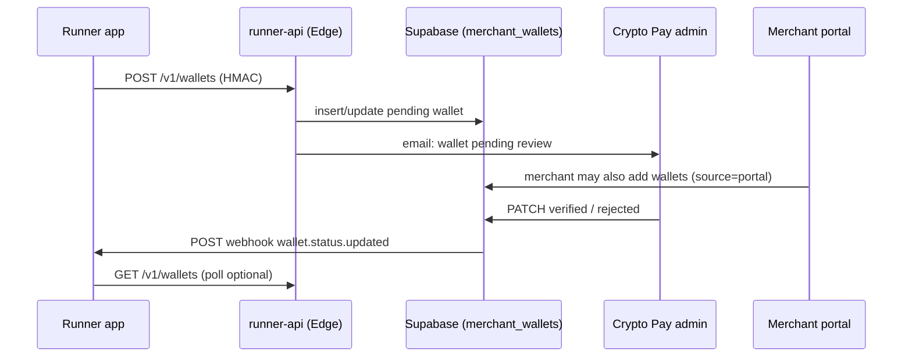

# Runner ↔ Crypto Pay integration

This document is for the **Runner payment processor** team (separate server) and anyone wiring machine-to-machine flows against Crypto Pay.

Crypto Pay owns:

- Merchant accounts (Supabase Auth + portal)
- **Payout wallet registry** (`merchant_wallets`) and **admin verification**
- The **Runner API** edge function (inbound: Runner → Crypto Pay)
- **Outbound webhooks** when a runner-linked wallet’s verification status changes

The Runner app owns:

- Payment processing, chain monitoring, settlement logic
- Mapping merchants/stores to Crypto Pay users
- Storing your own `external_id` per wallet row for idempotent sync

Payment checkout and on-chain monitoring live on Runner; Crypto Pay does **not** replace your processor—it links verified payout addresses to merchant accounts.

---

## Architecture



| Direction | Mechanism | Purpose |
|-----------|-----------|---------|
| Runner → Crypto Pay | HMAC-signed **Runner API** | Attach/list/delete pending wallets |
| Crypto Pay → Runner | HTTPS **webhook** (optional) | Push `verified` / `rejected` without polling |
| Merchant → Crypto Pay | Portal UI + `/api/account/wallets` | Same `merchant_wallets` table, `source=portal` |

---

## Data model

### `merchant_wallets`

| Column | Runner relevance |
|--------|------------------|
| `id` | UUID — Crypto Pay canonical wallet id (use in support tickets) |
| `user_id` | Supabase auth user — merchant account |
| `label` | Display name |
| `wallet_network` | `btc`, `eth`, `ltc`, `usdt`, `usdc` |
| `wallet_address` | On-chain payout address |
| `status` | `pending` → `verified` \| `rejected` |
| `source` | `runner_api` when created via Runner API; `portal` when created in UI |
| `runner_client_id` | FK to your API client row |
| `external_id` | **Your** stable id (store id, terminal id, etc.) — unique per `(runner_client_id, external_id)` |
| `is_primary` | If true, syncs legacy `user_wallet_profiles` row |
| `verification_requested_at` | When review was requested |
| `verified_at` / `verified_by` | Set on admin approve |
| `rejection_reason` | Set on admin reject |

**Rule:** Runner-created wallets always start as `pending`. They cannot be used for production settlement routing until `status = verified`.

### `runner_api_clients`

Machine credentials (created once per Runner deployment/environment).

| Column | Description |
|--------|-------------|
| `slug` | Stable name, e.g. `settlement-runner` |
| `api_key` | `cpk_…` — sent as `X-CryptoPay-Key` |
| `api_secret` | `cps_…` — used only for HMAC, never in browser |
| `webhook_url` | HTTPS endpoint on Runner for outbound events |
| `webhook_secret` | Shared secret for verifying Crypto Pay → Runner payloads |
| `is_active` | Disable to block inbound API |

### `runner_api_events`

Audit log (service role only). Useful for debugging handshake issues.

| `event_type` (examples) | Meaning |
|-------------------------|---------|
| `wallet.upsert` | Runner attached/updated a wallet |
| `wallet.delete` | Runner deleted a pending wallet |
| `webhook.wallet_status.delivered` | Outbound webhook HTTP 2xx |
| `webhook.wallet_status.failed` | Outbound webhook non-2xx |
| `webhook.wallet_status.error` | Network/timeout calling Runner |

---

## Wallet lifecycle

### 1. Runner attaches a wallet (pending)

When a merchant connects a payout address in Runner, call **POST /v1/wallets** with:

- `email` or `user_id` — must match an existing Crypto Pay merchant
- `external_id` — **required for idempotency** (your primary join key)
- `wallet_network`, `wallet_address`, `label`
- optional `is_primary`

Crypto Pay will:

1. Upsert `merchant_wallets` (`source = runner_api`, `status = pending`)
2. Write `runner_api_events`
3. Email admins that review is needed

### 2. Admin verification (Crypto Pay)

Operators use **Admin → Wallets** (`PATCH /api/admin/wallets`) to approve or reject.

- **Verified** — wallet is eligible for payout routing in Crypto Pay; Runner should treat as ready.
- **Rejected** — includes optional `rejection_reason`; merchant may fix and resubmit via portal or Runner.

### 3. Runner is notified (webhook)

If `webhook_url` is set on your `runner_api_clients` row, Crypto Pay **POSTs** a signed event when status leaves `pending`.

### 4. Optional polling

**GET /v1/wallets?email=…** or `?user_id=…` returns all wallets and statuses if you prefer pull over push.

---

## Inbound API (Runner → Crypto Pay)

**Base URL**

```text
https://<project-ref>.supabase.co/functions/v1/runner-api
```

Local Supabase:

```text
http://127.0.0.1:54321/functions/v1/runner-api
```

Set `RUNNER_API_BASE_URL` in the Runner app from the value printed by the client creation script.

### Authentication (every request)

Headers:

| Header | Value |
|--------|--------|
| `X-CryptoPay-Key` | `cpk_…` |
| `X-CryptoPay-Timestamp` | Unix seconds |
| `X-CryptoPay-Signature` | `hex(hmac_sha256(secret, payload))` |

**Payload string** (must match exactly):

```text
{timestamp}.{METHOD}.{path}.{raw_body}
```

- `METHOD` — uppercase (`GET`, `POST`, `DELETE`)
- `path` — route path only, e.g. `/v1/wallets` (no host, no `/functions/v1/runner-api` prefix)
- `raw_body` — empty string for GET/DELETE; exact JSON bytes for POST

**Clock skew:** ±300 seconds.

**Reference implementation:** `apps/portal/lib/runner-api/sign-request.ts`

**Edge verification:** `supabase/functions/_shared/runner-auth.ts`

### `GET /v1/wallets`

Query (one required):

- `user_id=<uuid>`
- `email=<merchant@example.com>`

**200 response**

```json
{
  "user_id": "uuid",
  "wallets": [
    {
      "id": "uuid",
      "user_id": "uuid",
      "label": "Main BTC",
      "wallet_network": "btc",
      "wallet_address": "bc1q…",
      "status": "pending",
      "is_primary": true,
      "external_id": "store-42-btc",
      "source": "runner_api",
      "verification_requested_at": "2026-05-27T12:00:00.000Z",
      "verified_at": null,
      "created_at": "…",
      "updated_at": "…"
    }
  ]
}
```

### `POST /v1/wallets`

**Body**

```json
{
  "email": "merchant@example.com",
  "external_id": "store-42-btc",
  "label": "Main BTC",
  "wallet_network": "btc",
  "wallet_address": "bc1q…",
  "is_primary": false
}
```

| Field | Required | Notes |
|-------|----------|-------|
| `email` or `user_id` | one of | Merchant must exist in Crypto Pay |
| `external_id` | strongly recommended | Idempotent upsert per runner client |
| `wallet_address` | yes | min length 12 |
| `wallet_network` | no | default `btc` |
| `label` | no | default `Runner wallet` |
| `is_primary` | no | clears other primaries for user if true |

**Responses:** `201` created, `200` updated (same `external_id`), `404` user not found, `409` duplicate label, `400` validation.

### `DELETE /v1/wallets/:id`

Only wallets with `status = pending` and matching `runner_client_id` may be deleted.

---

## Outbound webhooks (Crypto Pay → Runner)

Configure per client in Postgres (after migration `20260527180000_runner_webhook_config.sql`):

```sql
update public.runner_api_clients
set
  webhook_url = 'https://runner.yourcompany.com/hooks/cryptopay',
  webhook_secret = 'whsec_…'
where slug = 'settlement-runner';
```

### Event: `wallet.status.updated`

Sent when admin moves a **runner-linked** wallet from `pending` to `verified` or `rejected`.

**Method:** `POST`  
**Headers:**

| Header | Description |
|--------|-------------|
| `Content-Type` | `application/json` |
| `X-CryptoPay-Event` | `wallet.status.updated` |
| `X-CryptoPay-Timestamp` | Unix seconds |
| `X-CryptoPay-Signature` | Present if `webhook_secret` set — `hex(hmac_sha256(secret, "{timestamp}.{raw_body}"))` |

**Body**

```json
{
  "type": "wallet.status.updated",
  "previous_status": "pending",
  "wallet": {
    "id": "uuid",
    "user_id": "uuid",
    "external_id": "store-42-btc",
    "label": "Main BTC",
    "wallet_network": "btc",
    "wallet_address": "bc1q…",
    "status": "verified",
    "source": "runner_api",
    "is_primary": true,
    "verification_requested_at": "2026-05-27T12:00:00.000Z",
    "verified_at": "2026-05-27T14:00:00.000Z",
    "rejection_reason": null
  }
}
```

**Runner handler checklist**

1. Verify HMAC when `webhook_secret` is configured.
2. Match `wallet.external_id` to your local store/merchant record.
3. On `verified`, enable payout routing for that address.
4. On `rejected`, surface `rejection_reason` to the merchant in Runner UI.
5. Respond **HTTP 200** quickly; retry policy on Crypto Pay side is best-effort (see `runner_api_events`).

**Implementation:** `apps/portal/lib/runner-api/dispatch-wallet-webhook.ts`  
**Triggered from:** `PATCH /api/admin/wallets` after successful review.

---

## Linking strategy (recommended)

Use a **stable `external_id`** on every wallet you register:

```text
external_id = "{runner_merchant_id}:{network}"   e.g. "m_9182:btc"
```

| Step | Action |
|------|--------|
| Merchant onboarded in Runner | Ensure they have a Crypto Pay account (same email) |
| Merchant adds payout address in Runner | `POST /v1/wallets` with `external_id` |
| Store Crypto Pay `wallet.id` | Optional secondary key; `external_id` is enough for upserts |
| Admin approves | Receive webhook OR poll GET until `status === "verified"` |
| Payments | Runner processor uses `wallet_address` from your cache or periodic GET |

**Portal-created wallets** (`source = portal`) do not send runner webhooks unless you also set `runner_client_id` (not typical). Runner should only rely on webhooks for rows it created.

---

## Environment setup

### Crypto Pay repo (portal + Supabase)

| Variable | Where | Purpose |
|----------|--------|---------|
| `NEXT_PUBLIC_SUPABASE_URL` | portal | Project URL |
| `SUPABASE_SERVICE_ROLE_KEY` | server only | Admin scripts, service tasks |
| `NEXT_PUBLIC_SUPABASE_FUNCTIONS_URL` | portal (optional) | Override functions base for signing tests |

Create a runner client:

```bash
cd apps/portal
pnpm exec tsx scripts/create-runner-api-client.ts settlement-runner "Settlement Runner"
```

Save output:

```env
RUNNER_API_KEY=cpk_…
RUNNER_API_SECRET=cps_…
RUNNER_API_BASE_URL=https://<ref>.supabase.co/functions/v1/runner-api
```

Configure webhook (SQL or Supabase dashboard):

```env
# On Runner server
CRYPTOPAY_WEBHOOK_SECRET=whsec_…   # same as webhook_secret in DB
```

### Runner server

| Variable | Purpose |
|----------|---------|
| `RUNNER_API_KEY` | Inbound signing to Crypto Pay |
| `RUNNER_API_SECRET` | Inbound signing |
| `RUNNER_API_BASE_URL` | Edge function base |
| `CRYPTOPAY_WEBHOOK_SECRET` | Verify outbound webhooks |

Deploy edge function:

```bash
# From repo root — see docs/PROD_READINESS.md
supabase functions deploy runner-api
```

`verify_jwt` is **false** for `runner-api`; auth is HMAC only.

---

## Code examples

### Node.js — sign and attach wallet

```typescript
import { createHmac } from "crypto";

function sign(secret: string, ts: number, method: string, path: string, body: string) {
  const payload = `${ts}.${method}.${path}.${body}`;
  return createHmac("sha256", secret).update(payload).digest("hex");
}

async function attachWallet() {
  const base = process.env.RUNNER_API_BASE_URL!;
  const path = "/v1/wallets";
  const body = JSON.stringify({
    email: "merchant@example.com",
    external_id: "store-42-btc",
    label: "Main BTC",
    wallet_network: "btc",
    wallet_address: "bc1q…",
  });
  const ts = Math.floor(Date.now() / 1000);
  const res = await fetch(`${base}${path}`, {
    method: "POST",
    headers: {
      "Content-Type": "application/json",
      "X-CryptoPay-Key": process.env.RUNNER_API_KEY!,
      "X-CryptoPay-Timestamp": String(ts),
      "X-CryptoPay-Signature": sign(process.env.RUNNER_API_SECRET!, ts, "POST", path, body),
    },
    body,
  });
  console.log(res.status, await res.json());
}
```

Or reuse: `apps/portal/lib/runner-api/sign-request.ts` (`runnerApiHeaders`).

### Node.js — verify outbound webhook

```typescript
import { createHmac, timingSafeEqual } from "crypto";

function verifyWebhook(secret: string, timestamp: string, rawBody: string, signature: string) {
  const expected = createHmac("sha256", secret)
    .update(`${timestamp}.${rawBody}`)
    .digest("hex");
  return timingSafeEqual(Buffer.from(signature), Buffer.from(expected));
}
```

### Smoke test (Crypto Pay repo)

```bash
RUNNER_API_KEY=cpk_… RUNNER_API_SECRET=cps_… \
  pnpm --filter @crypto-pay/portal exec tsx scripts/test-runner-api.ts merchant@example.com
```

---

## Portal merchant flow (same table)

Merchants can add wallets in the account UI (`/account?tab=wallets`):

- Rows use `source = portal` (default)
- Same `pending` → admin `verified` / `rejected` flow
- **No runner webhook** unless the row is tied to your `runner_client_id`

Runner should not assume every verified wallet in Crypto Pay came from Runner—always check `external_id` / `source`.

---

## Errors & operations

| HTTP | Meaning |
|------|---------|
| 401 | Missing/invalid HMAC or unknown `api_key` |
| 403 | Client disabled or DELETE on another client’s wallet |
| 404 | User or wallet not found |
| 409 | Duplicate `label` or `external_id` conflict |
| 400 | Validation (address too short, bad network) |

**Support debugging**

1. `runner_api_events` for your `runner_client_id`
2. Admin wallet row: `status`, `rejection_reason`, `verified_at`
3. Confirm merchant email exists: `user_profiles` / Auth

---

## Related docs

| Doc | Topic |
|-----|--------|
| [ACCOUNT_SETUP_WORKFLOW.md](./ACCOUNT_SETUP_WORKFLOW.md) | Merchant onboarding, wallet tab |
| [ADMIN_AND_USER_API_REFERENCE.md](./ADMIN_AND_USER_API_REFERENCE.md) | Portal `/api/*` index |
| [API_STYLE_GUIDE.md](./API_STYLE_GUIDE.md) | Error shapes, auth patterns |
| [PROD_READINESS.md](./PROD_READINESS.md) | Edge deploy, secrets |

---

## Payment processing (Runner-owned)

Checkout, chain monitoring, and settlement callbacks are implemented on the **Runner server**, not in the Crypto Pay portal. Crypto Pay’s role for payments is:

1. Hold **verified** payout addresses per merchant
2. Expose this integration so Runner stays in sync with verification state

When you add payment APIs on Runner, document them in your service’s README and link back to `external_id` / `wallet.id` from this guide.

---

## Quick checklist for new Runner developers

- [ ] Obtain `RUNNER_API_KEY` / `RUNNER_API_SECRET` / base URL from platform team
- [ ] Implement HMAC signing exactly as specified
- [ ] Always send `external_id` on wallet attach
- [ ] Register `webhook_url` + `webhook_secret` in `runner_api_clients`
- [ ] Handle `wallet.status.updated` on Runner
- [ ] Poll `GET /v1/wallets` as fallback
- [ ] Only route funds to addresses with `status === "verified"`
- [ ] Deploy `runner-api` edge function to target Supabase project before production traffic
